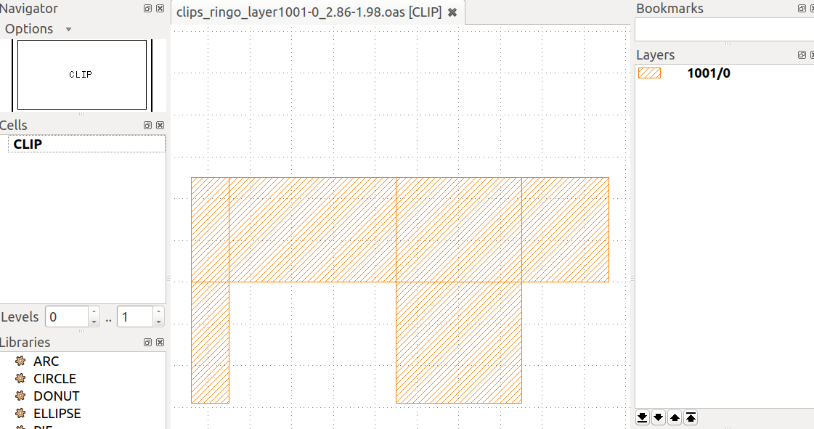
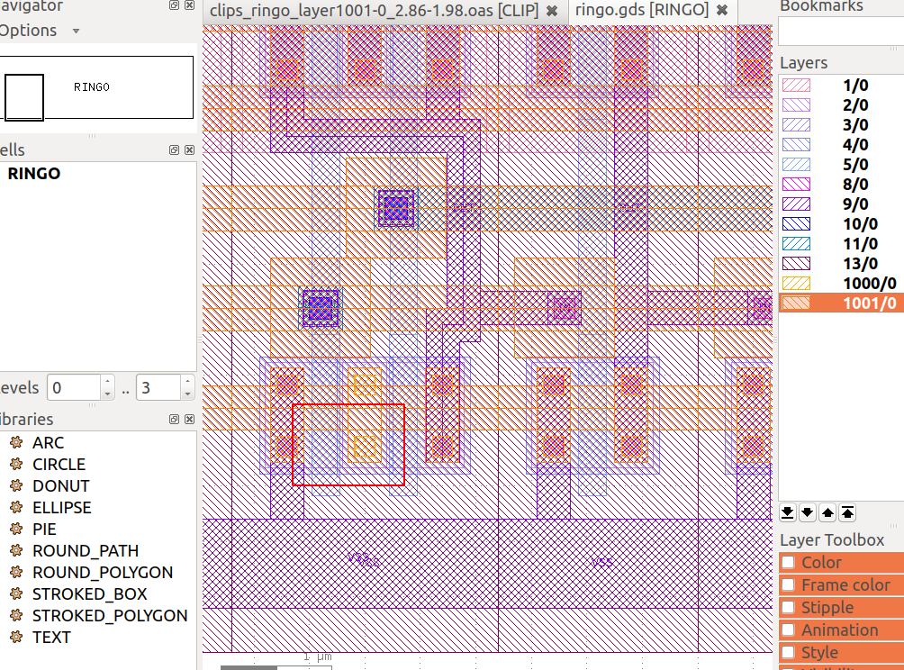
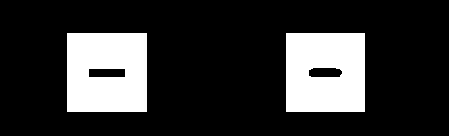
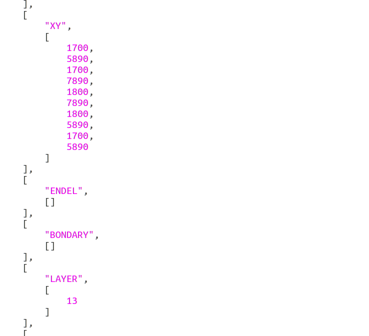

[toc]

# 目录结构

cut
├──README.md
├── clip.py
├── coor
├── cut-clips-from-huge-oasis
├── extract-single-layer.py
├── gds2ascii.py
├── get-layer-info.py
├── get-pics
├── launch.m
├── layer
├── OPC_TEST.m
├── gds （存放版图文件）
│   ├── ringo.gds
│   ├── t.gds
│   └── ttt.oas
（以下为生成的目录文件夹, ，文件都存入到版图文件命名的文件夹中）
├── ascii
│   ├── ringo
│   └── t
├── clips
│   ├── ringo
│   └── t
├── original_plot
│   ├── ringo
│   └── t
├── original_data
│   ├── ringo
│   └── t
└── process_data
      ├── ringo
      └── t


# get-pics

get-pics脚本是TOP脚本，实现对每一个./gds文件夹里的版图文件执行`./cut-clips-from-huge-oasis "$gds" "$layer" "$coor" $radius`

```shell
usage(){
  echo "Usage: ./t-pics inputGdsDir layer coor radius"
  echo "example: ./get-pics gds layer coor 0.2"
}
```


# CUT CLIP

cut-clips-from-huge-oasis 脚本从版图文件中切割一小部分版图，指定以下信息，生成的版图为不包含cell层次信息的单个cell，单层layer版图。然后调用matlab进行处理。

```shell
usage(){
  echo "Usage: ./cut-clips-from-huge-oasis inputLayoutFileName layersFileName coorFileName radius"
  echo "example: ./cut-clips-from-huge-oasis gds/ringo.gds layer coor 0.2"
}
```

其中

```
inputOasisFileName 被切割版图
layersFileName 指定的层（也可在程序内自动生成所有层信息则该信息不重要）：
    LAYER
    5/0
    1001/0
coorFileName 指定位置：
    X  Y
    1.15 0.85
    2.86 1.75
    3.30 3.95
    2.70 6.89
radius 		切割大小，以um为单位，与上面XY同单位。
```

## 核心步骤

```shell
echo "step-0: get layer info"
echo "step-1: extract single layer big oasis"
echo "step-2: cut clips from each single layer big oasis"
echo "step-3: transform gds to ascii"
echo "step-4: matlab read from json, resize and process "
```


## 结果
**cut** 结果将如下：



截自：




**step-4: matlab** 结果如下：

左边是切割结果，右边是低通滤波结果。（这里白色为背景，黑色是画图部分）




## step-3: transform gds to ascii

执行gds2ascii.py脚本后还会在./ascii文件夹中生成每个gds文件对应的.json文件（实际上并不是标准的json格式），用于描述版图的多边形信息，其中X，Y为版图中每个多边形的XY坐标，可用于下一步MATLAB读入绘图。其中文件如下：




## step-4: matlab read from json, resize and process

### ASCII TO MATLAB PLOT

在matlab脚本中，从gds2ascii的结果文件中读取数据到cell中。根据规律，数据应该从下面部分读取：

```"XY",      [   100,    200,    300,    400     ]```

读取后可以通过plot画边框/patch填充图形。


### PLOT TO RESIZE IMAGE

【画图时候掩膜图形是1（白），背景是0（黑）。但这样显示不好看，所以如果给人看的话可以存储成反色的，即白底，黑色为画图区域。】

（处理的【前提】是知道这个版图的截取范围坐标，即radius & (x,y) ，这里通过shell给matlab传参，在matlab内部通过对文件名分析得到。）对画好的窗口进行调整，使得保存的图形为需要的图形（即正常比例的截取范围的版图截图）。为保存成需要的正常比例正方形，需要对窗口大小进行一定调整。

保存后再读进来进行resize大小，为后续GAN做准备。


### 批量把ascii数据文件转换成需要的图像

shell生成需要的目录文件后，执行matalb脚本。

```matlab
%运行前先创建保存原始图片，resize图片（，&滤波后图片）的文件夹：
% % input: 
% ascii_dir='ascii/ringo'
% fname='ringo'

picdir='./original_plot/';
resizedir='./original_data/';
p_datadir='./process_data/';

save_o_path=strcat(picdir,fname,'/o_',filename(1:end-5),'.png');
save_r_path=strcat(resizedir,fname,'/r_',filename(1:end-5),'.png');
save_p_path=strcat(p_datadir,fname,'/p_',filename(1:end-5),'.png');
```

在launch.m文件中，对每一个文件，设定好需要的xx, yy, radius, filename变量后，调用OPC_TEST.m文件单独执行前两步步骤（ASCII TO MATLAB PLOT & PLOT TO RESIZE IMAGE）。


# 其他
【之前启动碰到一点问题 用这个暂时解决后再保存path好像就好了。`restoredefaultpath;matlabrc`

matlab -nodesktop -nosplash -r "a.m;quit" 都报错

```matlab
matlab -nodesktop -nosplash -r "cd ~/Documents/MATLAB/OPC;test;quit;"
```


# 问题

## 边缘采样点还没解决 

在获取边框后（很多点），如何确定滤波前后对应的采样点位置？

误差的算法


## GDS文件来源

从哪里找


## 【参数问题 

LAYOUT:

1. layer: 现在是采取对所有层都进行切割操作。
2. coor: 切割的中心位置坐标。如何决定？
3. radius: 切割半径。如何决定？（比如用5um？


MATLAB:

1. 低通滤波时候参数d决定距离中心多远的频率不要 ，现在是直接取d = min(a0,b0)/12，其中a0, b0为图形边长。（随便调的？
2. 版图截取的方形resize之后的大小M*M，现在直接取的是100 * 100像素的大小。（这似乎会影响滤波结果？


